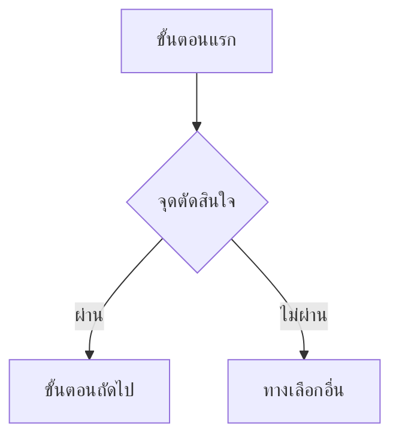

# Backlog → Feature List → User Journey

The backlog answers "what has to be built". The feature list answers "what does the product do", and the journeys answer "how does each person get through it". Both are **derived views of the backlog** — they never introduce work that no backlog row supports.

## Paths

| Document | Path |
| --- | --- |
| Source | `docs/01-requirements/backlog.md` |
| Feature list | `docs/01-requirements/02-plan/feature-list.md` |
| User journeys | `docs/01-requirements/02-plan/user-journey.md` |
| Log | `docs/05-log/{YYYYMMDD}-log.md` |

Both outputs live in `02-plan` because `02-plan/index.md` owns "ลำดับความสำคัญของแต่ละฟีเจอร์", and because a journey that maps back to `FR-` ids is a view of requirements rather than UI design — `02-design/01-prototypes` gets the wireframes and navigation flows later, once the specs are approved.

## Step 1 — Get today's date

```
Get-Date -Format 'yyyyMMdd HH:mm'
```

## Step 2 — Analyze

Launch the `feature-journey-analyst` subagent with `run_in_background: false`. It returns the feature grouping, MoSCoW priorities, one journey per actor with requirement mapping, drift against any existing documents, a proposed delivery order, and questions.

## Step 3 — Ask what is genuinely unclear

Put every question from the analyst to the user with `AskUserQuestion`.

**Each question carries at least 3 options, and each option states its ข้อดี and ข้อเสีย concretely.** Mark the recommended option `(แนะนำ)` and put it first, and say in the option text why it beats the others. A question you cannot give three real options for is not ready — merge it or move it to assumptions.

Ask when the answer changes the documents. Do not ask about things the backlog already settles — decide those and record them as assumptions in the feature list. Batch up to 4 questions per call.

If the user declines to answer, take the recommended option, write it into the assumptions section, and say plainly which assumptions you made on their behalf.

## Step 4 — Write the feature list

`docs/01-requirements/02-plan/feature-list.md`, in **Thai**. Summary table first, then one section per feature:

```markdown
# Feature List

รายการฟีเจอร์ที่สรุปจาก [[../backlog|Product Backlog]] — ทุกฟีเจอร์ประกอบจากรายการ backlog ที่มีอยู่จริง ไม่มีฟีเจอร์ใดที่ไม่มีแถวรองรับ

- **ความสำคัญ**: MoSCoW — ฟีเจอร์ได้ระดับ**สูงสุด**ของรายการ backlog ที่ประกอบกัน เพราะฟีเจอร์ส่งไม่ครบถ้าขาดรายการที่เป็น Must
- อัปเดตล่าสุด: {YYYY-MM-DD}

## ตารางสรุป

| ID | ฟีเจอร์ | ความสำคัญ | Spec | จำนวนรายการ | ลำดับส่งมอบ |
| --- | --- | --- | --- | --- | --- |
| FE-01 | | Must | SPEC-001 | 5 | 1 |

## รายละเอียดแต่ละฟีเจอร์

### FE-01 — {ชื่อ}

**ความสำคัญ**: Must — กำหนดโดย {BL-id}
**รายการ backlog**: {BL-id}, {BL-id}
**Requirement ที่รองรับ**: {FR-id}, {BR-id}

{คำอธิบาย 2-4 ประโยค — ฟีเจอร์นี้ทำอะไร ใครใช้ และแก้ปัญหาอะไร}

{ข้อสังเกต ถ้ามี — ข้ามหลาย spec, เป็น Must เพราะแถวเดียว, ต้องมีฟีเจอร์อื่นก่อน}
```

Rules:

- A feature with no backlog row is not a feature. Delete it rather than inventing a row.
- A backlog row that belongs to no feature is a finding — list it under a section `## รายการที่ยังไม่เข้าฟีเจอร์ใด` with the reason, and raise it in the report. Do not hide it.
- Cancelled rows (`ยกเลิก`) stay out of features, but if a cancelled row was replaced, note the replacement so the history reads.
- Every feature cites the `FR-`/`BR-` ids its rows trace to, so the chain `FR → BL → FE` is followable in both directions.

## Step 5 — Write the user journeys

`docs/01-requirements/02-plan/user-journey.md`, in **Thai**, one section per actor:

````markdown
# User Journey

เส้นทางการใช้งานของแต่ละบทบาท สรุปจาก [[feature-list|Feature List]] และ [[../backlog|Product Backlog]] — ทุกขั้นตอนอ้างกลับไปยัง requirement ได้

- อัปเดตล่าสุด: {YYYY-MM-DD}

## {ชื่อ actor}



| # | ขั้นตอน | ฟีเจอร์ | Requirement |
| --- | --- | --- | --- |
| 1 | {ขั้นตอน} | FE-01 | FR-003-01 |

{คำอธิบายเรียงตามลำดับขั้น — แต่ละขั้นเกิดอะไรขึ้น และทำไมจึงต้องมี}
````

Rules:

- Use **`flowchart TD`**, not Mermaid's `journey` type. These journeys branch — อนุมัติ/ตีกลับ, ผ่าน/ไม่ผ่าน, มีสัญญาณ/ออฟไลน์ — and `journey` cannot express a decision point.
- One journey per actor. An actor whose steps are all read-only still gets one; that is itself worth seeing.
- Every step maps to at least one requirement id in the table. **A step you cannot map is a gap in the specs** — report it to the user, do not quietly drop the step or invent the requirement.
- Where a spec already contains a journey (SPEC-003 ข้อ 5), the diagram must agree with it. If it cannot, that is a finding for the user, not something to reconcile silently.
- Keep node labels short. The explanation goes in the table and the prose below, never inside the diagram.

## Step 6 — Link both from the index

Add both documents to `docs/01-requirements/02-plan/index.md` as wikilinks with aliases. A document not reachable from its folder's `index.md` is invisible to anyone browsing the vault.

## Step 7 — Write the log

Append to `docs/05-log/{YYYYMMDD}-log.md`:

```markdown
## {HH:mm} — สร้าง/อัปเดต Feature List และ User Journey

**ที่มา**: backlog {n} รายการ (ใช้งาน {n} / ยกเลิก {n})
**ผลลัพธ์**: {n} ฟีเจอร์, {n} journey
**คำถามที่ถามและคำตอบ**: {คำถาม → คำตอบที่เลือก พร้อมเหตุผลย่อ}
**ข้อสมมติที่ตั้งไว้**: {ถ้ามี}
**รายการที่ยังไม่เข้าฟีเจอร์ใด**: {รายการ หรือ "ไม่มี"}
**ขั้นตอนที่อ้าง requirement ไม่ได้**: {รายการ หรือ "ไม่มี"}
**ไฟล์ที่เปลี่ยน**:
- {path}
```

## Step 8 — Report back

In Thai: how many features and journeys, the delivery order and why, which assumptions you made without confirmation, any backlog row that fell outside every feature, and any journey step with no requirement behind it. Then ask whether to commit and push — do not do it unprompted.

## Guardrails

- **Never edit the backlog or a spec.** Both outputs are derived. A problem found in the source is reported, not fixed here — the backlog goes through `audit-backlog`, a spec through `requirement-to-backlog`.
- Never invent a feature, a journey step, or a priority that the backlog does not support.
- Never write into `docs/02-design/`, `docs/03-testing/`, or `docs/04-retrospectives/`.
- Both documents are regenerated wholesale on each run, unlike the append-only backlog — so anything a human added by hand will be lost. If either file contains content the analyst did not produce, stop and ask before overwriting.
